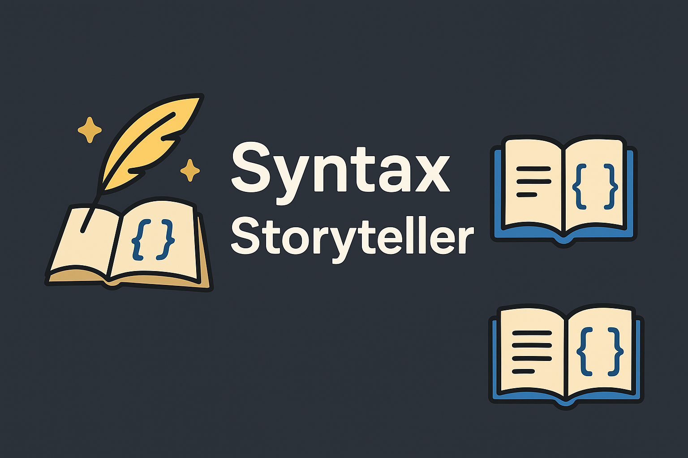

# 📖 Syntax Storyteller  

> Bring your code to life with stories! ✨  
> Syntax Storyteller wraps your selected code in creative, narrative-style comments — turning dry functions into epic tales.  


---

## ✨ Features  

- Highlight any code snippet and **transform it into a story**  
- Choose from **13+ writing styles**:  
  - Fantasy 🐉  
  - Sci-Fi 👾  
  - Shakespeare 🎭  
  - Noir Detective 🕵️  
  - Pirate ☠️  
  - Cyberpunk 💿  
  - Fairy Tale 🧚  
  - Greek Myth 🏛️  
  - Comedy 🤡  
  - Horror 👻  
  - Motivational 💡  
  - Romantic 💕  
  - Writer ✍️  

## 📝 Example  

### Before  
```ts
export function deactivate() { }
```

### After (Sci-Fi style)  
```ts
/*
👾 Among neon stars and binary systems,
*/
export function deactivate() { }
/*
A function booted with cosmic purpose to decode alien signals. But a rogue bug invaded its memory banks.
*/
```

---

## 🚀 Usage  

1. **Install** Syntax Storyteller in VS Code
2. **Select** any piece of code
3. **Right-click** the selected code and choose `Story: Tell me a Syntax Story 📖`
   - *OR* Open the Command Palette (`Ctrl+Shift+P` / `Cmd+Shift+P`) and run: `📖 Tell me a Syntax Story`
4. **Choose** a storytelling style
5. **Watch** your code turn into art 🎨

---

## 🧑‍💻 Author  

Made with ❤️ by [Ankit](https://ak-portfolio.vercel.app)

---

## 🔗 Links

- **GitHub**: [Source Code](https://github.com/Ankit628792/Syntax-Storyteller)
- **Portfolio**: [Ankit Kumar](https://ak-portfolio.vercel.app)
- **VS Code Marketplace**: [Download Extension](https://marketplace.visualstudio.com/items?itemName=Ankit628792.syntax-storyteller)

---

## 📄 License

This project is licensed under the [MIT License](LICENSE) - see the [LICENSE](LICENSE) file for details.

